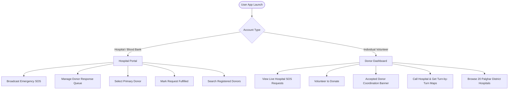

# BloodBridge — Comprehensive App User Guide & Flow Manual

Welcome to **BloodBridge**, a mission-critical emergency blood coordination application specially tailored for **Palghar District, Maharashtra**.

BloodBridge connects verified hospitals and blood banks with volunteer blood donors in real time during clinical emergencies.

---

## 📑 Table of Contents
1. [User Roles Overview](#1-user-roles-overview)
2. [Authentication & Onboarding Flow](#2-authentication--onboarding-flow)
3. [Hospital Portal Flow](#3-hospital-portal-flow)
   - [Creating an Emergency SOS Broadcast](#creating-an-emergency-sos-broadcast)
   - [Managing the Volunteer Donor Queue](#managing-the-volunteer-donor-queue)
   - [Selecting a Donor & Fulfilling the SOS](#selecting-a-donor--fulfilling-the-sos)
   - [Palghar District Donor Search](#palghar-district-donor-search)
4. [Donor Dashboard Flow](#4-donor-dashboard-flow)
   - [Browsing & Filtering Emergency Requests](#browsing--filtering-emergency-requests)
   - [Volunteering to Donate (Joining Queue)](#volunteering-to-donate-joining-queue)
   - [Accepted Donor Assignment Card](#accepted-donor-assignment-card)
   - [Contacting Hospital & Google Maps Directions](#contacting-hospital--google-maps-directions)
5. [Palghar District Hospital Directory](#5-palghar-district-hospital-directory)
6. [Notifications & Activity Center](#6-notifications--activity-center)
7. [Profile & Settings Management](#7-profile--settings-management)

---

## 1. User Roles Overview

The application features a strict dual-role architecture:

| Feature | 🏥 Hospital Account | 🩸 Donor Account |
| :--- | :---: | :---: |
| **Broadcast SOS Request** | ✅ Yes | ❌ No |
| **View Emergency Donor Queue** | ✅ Yes (Their broadcasts) | ❌ No |
| **Select / Accept a Donor** | ✅ Yes | ❌ No |
| **Mark SOS as Fulfilled** | ✅ Yes | ❌ No |
| **Volunteer to Donate** | ❌ No | ✅ Yes |
| **Accepted Assignment Card** | ❌ No | ✅ Yes (When selected) |
| **Call Hospital Desk / Directions** | ✅ Yes | ✅ Yes |
| **Bottom Navigation Bar** | Home • Emergency • Donors • Profile | Home • Requests • Hospitals • Profile |

---

## 2. Authentication & Onboarding Flow

### Registration (`RegisterScreen`)
When new users open the app and tap **Register**, they select their account type using a selector at the top:

#### Option A: Individual Donor
- **Full Name**: e.g., `Amit Patil`
- **Email & Password**: Used for sign in
- **Phone Number**: 10-digit mobile number for emergency coordination
- **Blood Group**: Selection (`A+`, `A-`, `B+`, `B-`, `AB+`, `AB-`, `O+`, `O-`)
- **City / Taluka**: e.g., `Palghar`, `Boisar`, `Dahanu`, `Wada`, `Manor`
- **Available for Emergency Donations**: Toggle switch enabling/disabling discovery by medical staff

#### Option B: Hospital / Blood Bank
- **Hospital Official Name**: e.g., `Rural Hospital Palghar`
- **Medical License / Reg. No.**: e.g., `MH-PLG-HOSP-2024`
- **Hospital Address**: Street, landmark, and area
- **City / Taluka**: Palghar district city or area
- **Emergency Helpline Phone**: Direct Casualty / Blood Storage Desk telephone
- **Official Email & Password**: Login credentials

### Login (`LoginScreen`)
- Enter email and password.
- BloodBridge retrieves the Firestore user profile and **automatically routes**:
  - Hospitals to the **Hospital Portal Shell**
  - Donors to the **Donor Dashboard Shell**

---

## 3. Hospital Portal Flow

### Creating an Emergency SOS Broadcast
1. From the Hospital Home screen or Emergency tab, tap **`BROADCAST HOSPITAL SOS REQUEST`** (or the red floating action button).
2. Fill in the emergency case details:
   - **Blood Group Required**: Select the target blood group.
   - **Units Needed**: Number of blood units required (1 to 20).
   - **Urgency Level**:
     - 🟡 **Standard**: Within 24 hours
     - 🟠 **Urgent**: Within 4–6 hours
     - 🔴 **Critical**: Immediate transfusion needed (< 1 hour)
   - **Patient Reference / Case ID** *(Optional)*: e.g., `EMERG-4412` or ICU bed reference.
   - **Hospital Contact Helpline**: Pre-filled with hospital's registered desk phone.
3. Tap **`Publish SOS Broadcast`**.
4. The broadcast is immediately published to Firestore and pushed to all matching volunteer donors in the district.

### Managing the Volunteer Donor Queue
1. In the **Emergency** tab (or from the Home screen's *"Your Active SOS Broadcasts"* section), hospitals see only their own broadcasts.
2. Tap **`Manage Queue`** on any active broadcast card.
3. The **Request Details** screen opens with the live **Volunteer Donor Queue**:
   - Lists all matching donors who volunteered for this specific case.
   - Displays donor name, blood group, contact information, and time volunteered.

### Selecting a Donor & Fulfilling the SOS
1. Tap **`Select Donor`** next to the chosen volunteer in the queue.
2. Confirm the selection dialog:
   - The donor's status is changed to `Selected`.
   - An in-app alert is dispatched to the donor's device.
   - The request is **removed from other donors' open feeds** to prevent duplicate volunteer dispatches.
3. **Fulfilling the Request**:
   - Once the donor arrives and the blood donation is collected, tap **`Mark as Fulfilled`**.
   - The SOS status updates to `Fulfilled`.
   - The selected donor is awarded **+1 Donation** and **+1 Life Saved** on their profile.
   - The donor receives a completion notification.

### Palghar District Donor Search
- Tap the **Donors** tab in the bottom navigation bar.
- Search registered volunteer donors across Palghar by:
  - Blood group chip filter
  - Availability status (Available now vs. On hold)
  - Location/city matching

---

## 4. Donor Dashboard Flow

### Browsing & Filtering Emergency Requests
- Tap the **Requests** tab in the navigation bar.
- Donors see active, hospital-verified blood requirements across the district.
- Tap the **Filter icon** to filter requests by a specific blood group (e.g., only show `O-` requests).

### Volunteering to Donate (Joining Queue)
1. Tap **`Respond`** on any open emergency blood card.
2. Review the case details, patient case reference, urgency ring, and hospital name.
3. Tap **`Volunteer to Donate`**:
   - You are added to the hospital's priority response queue.
   - The medical staff at the hospital is notified immediately.

### Accepted Donor Assignment Card
When the hospital selects you from their queue:
1. A **highlighted green assignment card** appears at the top of your **Home screen** and **Requests screen**:
   - **Header**: 🌟 `YOU ARE THE ACCEPTED DONOR!`
   - **Hospital Name & Location**: e.g., `Rural Hospital Palghar • Palghar`
   - **Case Summary**: Units required, blood group, case ID
   - **Instructions Box**: Clear guidance to coordinate immediately with the hospital casualty desk.

### Contacting Hospital & Google Maps Directions
Direct action buttons are right on the accepted card:
- 📞 **`Call Hospital (<Phone>)`**:
  - Automatically opens your phone's native dialer with the hospital casualty desk number pre-dialed.
- 🧭 **`Directions`**:
  - Automatically opens Google Maps with turn-by-turn navigation directly to the hospital's GPS coordinates.
- 📋 **`View Case`**:
  - Opens the full case sheet with verification badges and hospital notes.

---

## 5. Palghar District Hospital Directory

Donors can browse all verified health facilities in Palghar District via the **Hospitals** tab (or *"View All (20)"* from the Home screen):

### Covered Facilities Across 8 Talukas
Includes 20 major government hospitals, sub-district hospitals, rural trauma centers, and private blood storage units:
1. **Rural Hospital Palghar** (Palghar East)
2. **Sub-District Hospital Dahanu** (Dahanu)
3. **Sub-District Hospital Jawhar** (Jawhar)
4. **Rural Hospital Wada** (Wada)
5. **Rural Hospital Boisar (TAPS Colony)** (Boisar)
6. **Rural Hospital Kasa** (Kasa / NH-48)
7. **Rural Hospital Manor** (Manor)
8. **Rural Hospital Talasari** (Talasari)
9. **Rural Hospital Vikramgad** (Vikramgad)
10. **Rural Hospital Mokhada** (Mokhada)
11. **Dhawale Memorial Hospital & Blood Bank** (Palghar)
12. **Sanjivani Hospital & Critical Care** (Boisar)
13. **Anand Hospital & Trauma Care** (Boisar)
14. **Bhakti Vedanta Hospital Outreach** (Dahanu)
15. **Vedanta Institute of Medical Sciences** (Dhundalwadi / Dahanu)
16. **Sub-District Trauma Care Center Manor** (Manor / Mumbai-Ahmedabad Hwy)
17. **Talasari Community Health Center** (Talasari)
18. **Jawhar Cottage Hospital** (Jawhar)
19. **Tarapur Atomic Power Station Hospital** (TAPS, Boisar)
20. **Palghar Municipal Maternity & General Hospital** (Palghar)

### Direct Actions on Hospital Cards:
- **Call Button**: Direct telephone link to casualty / emergency desk.
- **Directions Button**: Launches Google Maps navigation with exact coordinates.
- **Tap Card**: Opens a bottom sheet detailing 24/7 emergency readiness, blood storage facility availability, full address, and coordinates.

---

## 6. Notifications & Activity Center

- Tap the **Bell icon** in the top AppBar.
- Unread badge counter indicates new updates.
- Notifications include:
  - 🩸 **New Matching SOS Broadcast**: When a hospital in your area requests your blood group.
  - 🎉 **Donor Selection Notice**: When a hospital accepts you from their queue.
  - ❤️ **Donation Fulfilled Notice**: When your donation is marked fulfilled.
- Tapping a notification opens the related case directly.
- Tap **"Mark all read"** to clear unread badges.

---

## 7. Profile & Settings Management

### For Donors:
- **Donation Statistics**: Displays total **Donations Completed** and **Lives Saved** (automatically credited when hospitals mark donations fulfilled).
- **Emergency Availability Toggle**: Flip on/off if temporarily ineligible or traveling.
- **Contact Info & City**: Displays registered phone, email, and blood type.
- **Sign Out**: Clean logout back to authentication.

### For Hospitals:
- **Facility Verification Badge**: Verified Medical Partner Network banner.
- **Registration Reference**: Displays medical license number and official address.
- **Broadcast History**: Direct shortcut to view past SOS requests.
- **Sign Out**: Secure portal logout.
